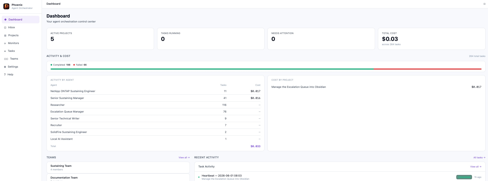

# Phoenix

A self-hosted AI agent orchestration platform. Give agents personas and instructions, assign them to projects, run tasks — backed by local coding tools or any LLM endpoint.

**Single binary. SQLite. No cloud dependency.**

---



---

## What it does

| Feature | Description |
|---|---|
| **Agents** | Reusable AI personas with instructions, guardrails, and a provider. |
| **Projects** | Human-driven workspaces with an optional working directory on disk. |
| **Monitors** | Autonomous projects driven by a heartbeat agent on a schedule. |
| **Tasks** | Run immediately, stream output live, track cost. |
| **Follow-up threads** | Chat-style refinement on any task — previous output carried forward as context. |
| **Quick Tasks** | One-off tasks without a project (⌘K from anywhere). |
| **Inbox** | Failed tasks, awaiting-approval tasks, and pending agent hire proposals in one place. |
| **Heartbeats** | Agents with an interval auto-fire scheduled tasks per assigned project or monitor. |
| **Agent spawning** | Agents delegate work to other agents via the Phoenix API. |
| **Agent hiring** | Agents propose new hires → land in Inbox for human approval before any agent is created. |
| **Teams** | Group agents into named teams; assign a whole team to a project at once. Export/import as bundles. |
| **Global guardrails** | Platform-wide rules injected into every agent's system prompt, managed in Settings. |
| **Cost tracking** | Token costs tracked per task, per agent, per project. Charts on the dashboard. |
| **Themes** | 5 built-in themes (Dark, Midnight, Forest, Ember, Light), live switcher. |
| **DB backup** | `GET /api/admin/backup` streams a consistent SQLite snapshot safe during live operation. |

---

## Quick start

### Prerequisites

- Go 1.21+
- Node.js 18+
- At least one provider:
  - An OpenAI-compatible LLM endpoint (OpenAI, Anthropic, LM Studio, LLM Proxy…)
  - **Ollama** for local models (`qwen3.5`, `llama3`, `mistral`…)
  - A local coding agent: [`pi`](https://github.com/earendil-works/pi), [`opencode`](https://opencode.ai), [`claude`](https://www.anthropic.com/claude-code), or [`crush`](https://github.com/charmbracelet/crush)

### Build & run

```bash
git clone https://github.com/solarisjon/phoenix
cd phoenix
cd web && npm install && cd ..
make build
./phoenix
# → http://localhost:8080
```

Data lives at `~/.local/share/phoenix/phoenix.db` — created automatically on first run.

```bash
PHOENIX_PORT=9000 ./phoenix   # custom port
```

### Deploy (build + restart in one step)

```bash
make deploy
```

Builds the frontend, compiles the Go binary, kills the running instance, starts it fresh, and verifies it came up. Logs go to `/tmp/phoenix.log`.

---

## Providers

### Ollama (local models)

Run models locally — no API key required.

1. Install [Ollama](https://ollama.com) and pull a model: `ollama pull qwen3.5:latest`
2. Settings → Providers → Add Provider → **🧠 Ollama (local models)**
3. Enter the model name (`qwen3.5:latest`, `llama3.2:3b`, `mistral:7b`…)

Thinking tokens (chain-of-thought from qwen3, deepseek-r1) are suppressed by default. Enable *Show thinking tokens* to surface the reasoning.

### LLM endpoints

Any OpenAI-compatible chat completions endpoint:

```json
{
  "endpoint": "https://api.openai.com/v1/chat/completions",
  "auth_header": "Authorization: Bearer ${OPENAI_API_KEY}",
  "model": "gpt-4o",
  "cost_per_input_token": 0.0000025,
  "cost_per_output_token": 0.00001
}
```

Use `${ENV_VAR}` for secrets — expanded at runtime, never stored in plaintext.

### Coding agents

Spawns a local subprocess. System prompt and task are delivered to the tool; output is streamed live.

| Kind | Binary | How it runs |
|---|---|---|
| `pi` | `pi` | `pi --print --mode json`, prompt via stdin |
| `opencode` | `opencode` | `opencode run --format json` |
| `claudecode` | `claude` | `claude --print --output-format stream-json --verbose` |
| `crush` | `crush` | `crush run --quiet`, system prompt via `AGENTS.md` |

The project **Working Directory** overrides the provider-level `working_dir`, so one provider can serve multiple projects in different repos.

### Resyncing a provider

If you rotate an API key or change a config file outside Phoenix (e.g. regenerating a pi key), hit **↺ Resync** on the provider card in Settings → Providers. This clears the cached adapter so the next task picks up the new config without a restart.

---

## Agents

Settings → Agents → **+ New Agent**

- **Name** — display name
- **Persona** — who the agent is (role, seniority, communication style)
- **Instructions** — what the agent does and how
- **Guardrails** — hard constraints, things it must never do
- **Provider** — which LLM or coding tool powers this agent
- **Model Override** — overrides the provider's default model for this agent only

Click **✦ Generate with AI** to draft persona, instructions, and guardrails from a plain-English description.

### Heartbeats

Set a **Heartbeat Interval** (minimum 60s) and the agent automatically receives a scheduled task for each project or monitor it's assigned to. If the agent already has a running or queued task in that project, the heartbeat is skipped for that cycle.

### Agent spawning

Enable **Allow agent to spawn tasks for other agents**. The agent's system prompt gains instructions to call `POST /api/agents/spawn`, creating tasks for any other agent by ID.

### Agent hiring

Enable **Allow agent to hire new agents 🧑‍💼**. When the agent identifies a capability gap, it can propose a new hire via `POST /api/agent-drafts`. The proposal lands in **Inbox → Pending Hires** for human review — name, persona, instructions, guardrails, and provider are all editable before approval. No agent is ever created without human sign-off.

---

## Projects

Human-driven workspaces. Create a project, assign one or more agents, and run tasks. Tasks chain together as follow-up threads.

An optional **Working Directory** is passed to coding agents as their working directory on disk. Set it to the repo or folder the agent should operate in.

### Follow-up threads

On any completed or failed task, type a reply to continue the work. The previous output is automatically injected as context. Threads chain indefinitely. Available from task cards in the project view and from any task detail modal.

---

## Monitors

Autonomous projects driven by a heartbeat agent. A monitor has a name, an optional working directory, and one assigned heartbeat agent. The agent wakes on its interval, does its work (triaging a queue, checking a system, generating a report), and sleeps. Run history is shown in the Monitor detail view.

Create a monitor: Monitors → **+ New Monitor**. You must have at least one agent with a heartbeat interval configured.

---

## Teams

Group agents into named teams. Assign a whole team to a project in one click.

**Export a team bundle** — agents + provider templates (no secrets) — and import it on another Phoenix instance via the 3-step import wizard. Useful for sharing vetted agent configurations.

---

## Quick Tasks

Press **⌘K** (or click the ✦ button) from anywhere to run a one-off task without creating a project. Quick Tasks run in an internal sandbox project and appear in the Tasks page.

---

## Inbox

Three sections, highest priority first:

1. **Pending Hires** — agent hire proposals awaiting approval. Edit, approve with provider selection, or reject.
2. **Awaiting Approval** — tasks where an agent requested human sign-off. Approve, revise with feedback, or reject.
3. **Failed** — tasks that errored. Retry, follow up, or dismiss.

The sidebar badge counts all three categories in real time. Use **Dismiss all** to bulk-clear a section.

---

## Global guardrails

Settings → System → **Global Guardrails**. Rules entered here are appended to every agent's system prompt under a mandatory section. Use for organisation-wide constraints (e.g. "never commit directly to main", "always write tests"). Click **✦ Generate** to draft them from a plain-English description.

---

## API reference

### Providers
| Method | Path | |
|---|---|---|
| GET | `/api/providers` | List all |
| POST | `/api/providers` | Create |
| GET/PUT/DELETE | `/api/providers/:id` | Read / update / delete |
| GET | `/api/providers/:id/models` | List available models |
| POST | `/api/providers/:id/resync` | Clear cached adapter (hot-reload config) |

### Agents
| Method | Path | |
|---|---|---|
| GET | `/api/agents` | List all |
| POST | `/api/agents` | Create |
| GET/PUT/DELETE | `/api/agents/:id` | Read / update / delete |
| POST | `/api/agents/generate` | AI-generate persona / instructions / guardrails |
| POST | `/api/agents/spawn` | Create a task on behalf of an agent |

### Agent Drafts (hiring)
| Method | Path | |
|---|---|---|
| GET | `/api/agent-drafts` | List pending hire proposals |
| POST | `/api/agent-drafts` | Submit a hire proposal |
| PUT | `/api/agent-drafts/:id` | Edit a draft |
| POST | `/api/agent-drafts/:id/approve` | Approve → creates live agent |
| POST | `/api/agent-drafts/:id/reject` | Reject |
| POST | `/api/agent-drafts/:id/dismiss` | Dismiss |

### Projects
| Method | Path | |
|---|---|---|
| GET | `/api/projects` | List all (add `?kind=project` or `?kind=monitor` to filter) |
| POST | `/api/projects` | Create |
| GET/PUT/DELETE | `/api/projects/:id` | Read / update / delete |
| GET/POST | `/api/projects/:id/agents` | List / assign agents |
| DELETE | `/api/projects/:id/agents/:agentId` | Remove agent |
| POST | `/api/projects/:id/teams` | Assign a whole team |

### Tasks
| Method | Path | |
|---|---|---|
| GET | `/api/tasks?project_id=` | List project tasks |
| POST | `/api/tasks` | Create and run |
| POST | `/api/tasks/quick` | Create quick task (sandbox project) |
| GET | `/api/tasks/running` | All running + queued (cross-project) |
| GET | `/api/tasks/attention` | All failed + awaiting-approval (cross-project) |
| GET/PUT/DELETE | `/api/tasks/:id` | Read / edit / delete |
| POST | `/api/tasks/:id/retry` | Re-run a failed task |
| POST | `/api/tasks/:id/dismiss` | Soft-hide from inbox |
| POST | `/api/tasks/:id/followup` | Create a follow-up task |

### Inbox
| Method | Path | |
|---|---|---|
| GET | `/api/inbox` | Failed + awaiting-approval tasks |
| POST | `/api/inbox/dismiss-all` | Bulk dismiss (`?filter=failed\|awaiting\|all`) |
| POST | `/api/inbox/:taskId/approve` | Approve |
| POST | `/api/inbox/:taskId/reject` | Reject |
| POST | `/api/inbox/:taskId/revise` | Send feedback and re-run |

### Teams
| Method | Path | |
|---|---|---|
| GET | `/api/teams` | List all |
| POST | `/api/teams` | Create |
| GET/PUT/DELETE | `/api/teams/:id` | Read / update / delete |
| GET/POST | `/api/teams/:id/agents` | List / add agents |
| DELETE | `/api/teams/:id/agents/:agentId` | Remove agent |
| POST | `/api/teams/:id/assign/:projectId` | Assign whole team to project |
| GET | `/api/teams/:id/export` | Export team bundle JSON |
| POST | `/api/import/team` | Import a team bundle |

### Stats & Admin
| Method | Path | |
|---|---|---|
| GET | `/api/stats/costs` | Cost totals and chart data |
| GET | `/api/admin/backup` | Stream a consistent SQLite snapshot |
| GET/PUT | `/api/admin/settings` | Read / update global guardrails |
| POST | `/api/admin/settings/generate-guardrails` | AI-generate global guardrails |

### WebSocket
| | `/api/ws` | Events: `task.status_changed`, `task.output_stream`, `agent.status_changed`, `inbox.new_item`, `agent_draft.created` |

---

## Database & backup

Single SQLite file at `~/.local/share/phoenix/phoenix.db`.

**Download a snapshot while running:**

Settings → System → **Download Backup**, or:

```bash
curl -o backup.db http://localhost:8080/api/admin/backup
```

Uses `VACUUM INTO` for a WAL-consolidated snapshot — safe during live operation.

---

## Development

```bash
make test        # run all Go tests
make build       # full production build (frontend + Go binary)
make deploy      # build + kill + restart + health check
```

Frontend dev server (proxies API to `:8080`):

```bash
cd web && npm run dev   # → http://localhost:5173
```

### Project structure

```
cmd/phoenix/           entry point — wires repos, starts scheduler
internal/
  api/                 HTTP handlers + WebSocket hub
  agent/               task runner + prompt assembly
  scheduler/           heartbeat ticker management
  provider/            Provider interface + adapters
    llm/               OpenAI-compatible HTTP adapter
    ollama/            Ollama local model adapter
    opencode/          opencode CLI adapter
    pi/                pi CLI adapter (stdin prompt delivery)
    claudecode/        Claude Code CLI adapter
    crush/             crush CLI adapter (AGENTS.md lifecycle)
    registry/          builds Provider instances from DB records
  store/               repository interfaces
    sqlite/            SQLite implementations + embedded migrations
  model/               shared domain types
  frontend/            embedded React dist (web/dist → compiled in)
web/                   React + TypeScript + Vite + Tailwind
```

### Migrations

SQL files in `internal/store/sqlite/migrations/` are embedded and applied in order at startup. To add a migration, create `NNN_description.sql` with a number higher than the current highest.

---

## Roadmap

See [GitHub Issues](https://github.com/solarisjon/phoenix/issues) for the full backlog.

Upcoming:
- Task cancellation (SIGTERM a running task)
- Model picker dropdown (list available models per provider)
- Per-agent activity log
- Token usage detail in task output
- Full-text task search
- Copilot CLI adapter
- Multi-user authentication

---

## License

MIT
