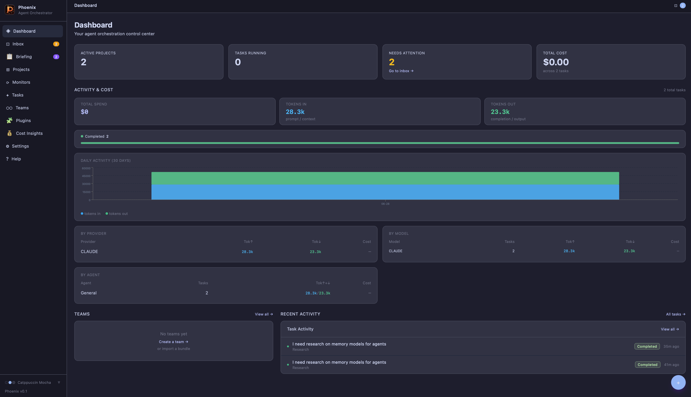

# Phoenix

A self-hosted **harness engineering** platform for AI agents. Define agents with personas, instructions, and guardrails; wire them to projects and monitors; let them run tasks autonomously or on a schedule — backed by local coding tools or any LLM endpoint.

**Harness engineering** means treating AI agents as a repeatable, inspectable harness around your workflows: each run is tracked, costs are measured, outputs are auditable, and humans stay in the loop via guardrails and approval gates.

**Single binary. SQLite. No cloud dependency.**

---



---

## What it does

| Feature | Description |
|---|---|
| **Agents** | Reusable AI personas with instructions, guardrails, and a provider. |
| **Projects** | Goal-driven workspaces. Set an objective, compose tasks, and let AI suggest what to do next. Tasks grouped by status — needs attention, running, failed, completed. Full history preserved even after inbox dismissal. |
| **Monitors** | Harness engineering for recurring work — autonomous projects on a schedule. Set a fixed interval or a daily trigger time (e.g. 07:00). Catch-up mode fires the run on the next available tick if the machine was offline at the scheduled time. Health-signal dots show run state at a glance. |
| **Tasks** | Run immediately, stream output live, track cost and token usage. Click any active task on the dashboard for a live-streaming detail view. |
| **Follow-up threads** | Chat-style refinement on any task — previous output carried forward as context. |
| **Quick Tasks** | One-off tasks without a project (⌘K from anywhere). |
| **Inbox** | Failed, awaiting-approval, completed tasks, and pending agent hire proposals in one place. Dismissing from Inbox no longer removes tasks from the project view. |
| **Critic / Devil's Advocate** | Toggle a critic on any task. `builtin` spins up an ephemeral contrarian review using the same provider; `agent:<id>` routes to a specific registered agent. |
| **Agent spawning** | Agents delegate work to other agents via the Phoenix API. |
| **Agent hiring** | Agents propose new hires → land in Inbox for human approval before any agent is created. |
| **Teams** | Group agents into named teams; assign a whole team to a project at once. Export/import as bundles. |
| **Briefing / Memos** | Agents embed `MEMO_START…MEMO_END` blocks in output → auto-saved to Briefing. Manually pin any task output. Sidebar badge counts unread. |
| **Artifacts** | Agents embed `ARTIFACT_START…ARTIFACT_END` blocks → auto-saved to project working directory and linked in Briefing. |
| **File browser** | Browse the project working directory from inside the workspace. Preview text, code, and markdown files in-pane. |
| **Global guardrails** | Platform-wide rules injected into every agent's system prompt, managed in Settings. |
| **Usage tracking** | Tokens and cost tracked per task, per agent, per project, per provider, and per model. Dashboard shows totals, daily bar chart, and full breakdowns — making the economics of your harness visible. |
| **Plugins** | Extend Phoenix with notifiers (Telegram, Webhook) and custom themes. Core plugins ship built-in; community plugins can be enabled separately. |
| **Task templates** | Save reusable prompt scaffolds. Optionally scope to a project or agent. Apply from the task compose panel. |
| **Provider health checks** | Background ping every 10 minutes; status shown on each provider card. Manual test via the Test button. |
| **Retry with edit** | On any failed task, edit the title and description before re-running. The new run is linked as a follow-up. |
| **Task priority** | Bump a queued task to jump ahead of others. Higher-priority tasks run first; ties broken by creation time. |
| **Obsidian integration** | Connect Obsidian vaults. Agents can write notes directly to vault files. Auto-write mode creates a note after every task. Configure vault paths in Settings → Obsidian. |
| **Cost insights** | Trend analysis and anomaly flags on the Dashboard cost view. |
| **Monitor pause** | Pause a monitor to stop new runs without archiving it. Resume when ready. |
| **Full-text search** | FTS5 search across tasks, agents, and projects from the Tasks page search bar. |
| **Custom themes** | 15 built-in themes (8 dark, 7 light). Create unlimited custom themes via the visual editor in Settings → Plugins → Themes. |
| **DB backup** | `GET /api/admin/backup` streams a consistent SQLite snapshot safe during live operation. |

---

## Quick start

### Prerequisites

- Go 1.21+
- Node.js 18+
- At least one provider:
  - An OpenAI-compatible LLM endpoint (OpenAI, Anthropic, LM Studio, LLM Proxy…)
  - **Ollama** for local models (`qwen3.5`, `llama3`, `mistral`…)
  - A local coding agent: [`pi`](https://github.com/earendil-works/pi), [`opencode`](https://opencode.ai), [`claude`](https://www.anthropic.com/claude-code), or [`crush`](https://github.com/charmbracelet/crush)

### Build & run

```bash
git clone https://github.com/solarisjon/phoenix
cd phoenix
cd web && npm install && cd ..
make build
./phoenix
# → http://localhost:8080
```

Data lives at `~/.local/share/phoenix/phoenix.db` — created automatically on first run.

| Variable | Default | |
|---|---|---|
| `PHOENIX_PORT` | `8080` | HTTP listen port |
| `PHOENIX_DB_PATH` | `~/.local/share/phoenix/phoenix.db` | Database file location |
| `PHOENIX_TASK_TIMEOUT` | `30m` | Max duration for a single task |
| `PHOENIX_HEALTH_CHECK_INTERVAL` | `10m` | How often providers are pinged |
| `PHOENIX_CORS_ORIGIN` | _(none)_ | Extra allowed CORS origins |

### Deploy (build + restart in one step)

```bash
make deploy
```

Builds the frontend, compiles the Go binary, kills the running instance, starts it fresh, and verifies it came up. Logs go to `/tmp/phoenix.log`.

---

## Providers

### Ollama (local models)

Run models locally — no API key required.

1. Install [Ollama](https://ollama.com) and pull a model: `ollama pull qwen3.5:latest`
2. Settings → Providers → Add Provider → **🧠 Ollama (local models)**
3. Enter the model name (`qwen3.5:latest`, `llama3.2:3b`, `mistral:7b`…)

Thinking tokens (chain-of-thought from qwen3, deepseek-r1) are suppressed by default. Enable *Show thinking tokens* to surface the reasoning.

### LLM endpoints

Any OpenAI-compatible chat completions endpoint:

```json
{
  "endpoint": "https://api.openai.com/v1/chat/completions",
  "auth_header": "Authorization: Bearer ${OPENAI_API_KEY}",
  "model": "gpt-4o",
  "cost_per_input_token": 0.0000025,
  "cost_per_output_token": 0.00001
}
```

Use `${ENV_VAR}` for secrets — expanded at runtime, never stored in plaintext.

### Coding agents

Spawns a local subprocess. System prompt and task are delivered to the tool; output is streamed live.

| Kind | Binary | How it runs |
|---|---|---|
| `pi` | `pi` | `pi --print --mode json`, prompt via stdin |
| `opencode` | `opencode` | `opencode run --format json` |
| `claudecode` | `claude` | `claude --print --output-format stream-json --verbose` |
| `crush` | `crush` | `crush run --quiet`, system prompt via `AGENTS.md` |

The project **Working Directory** overrides the provider-level `working_dir`, so one provider can serve multiple projects in different repos.

### Resyncing a provider

If you rotate an API key or change a config file outside Phoenix (e.g. regenerating a pi key), hit **↺ Resync** on the provider card in Settings → Providers. This clears the cached adapter so the next task picks up the new config without a restart.

### Provider health checks

Phoenix pings each provider in the background every 10 minutes and shows the result on the provider card (green = healthy, red = failed, grey = not yet checked). Click **Test** on any provider card to run an on-demand check.

Environment: `PHOENIX_HEALTH_CHECK_INTERVAL` (default `10m`).

---

## Agents

Settings → Agents → **+ New Agent**

- **Name** — display name
- **Persona** — who the agent is (role, seniority, communication style)
- **Instructions** — what the agent does and how
- **Guardrails** — hard constraints, things it must never do
- **Provider** — which LLM or coding tool powers this agent
- **Model Override** — overrides the provider's default model for this agent only

Click **✦ Generate with AI** to draft persona, instructions, and guardrails from a plain-English description.

### Agent spawning

Enable **Allow agent to spawn tasks for other agents**. The agent's system prompt gains instructions to call `POST /api/agents/spawn`, creating tasks for any other agent by ID.

### Agent hiring

Enable **Allow agent to hire new agents 🧑‍💼**. When the agent identifies a capability gap, it can propose a new hire via `POST /api/agent-drafts`. The proposal lands in **Inbox → Pending Hires** for human review — name, persona, instructions, guardrails, and provider are all editable before approval. No agent is ever created without human sign-off.

---

## Projects

Goal-driven workspaces with a **three-pane layout**: project list on the left, task view in the centre, task detail on the right.

**Objective:** Every project has a plain-English objective — click the objective field to edit it inline. This is the high-level statement of what the project is trying to accomplish (e.g. "Build out articles and resources to help managers grow").

**Working Directory:** An optional filesystem path passed to coding agents as their working directory. Set it to the repo or folder the agent should operate in. Also acts as the artifact and memory store for the project.

**Task view — status grouped:** Tasks are organised into collapsible sections by priority:
1. **Needs Attention** — tasks awaiting your approval (amber)
2. **Running** — active or queued tasks (violet)
3. **Failed** — errored tasks with a retry link (red)
4. **Completed** — full history, including tasks previously dismissed from Inbox (emerald, collapsed by default)

Dismissing a task from Inbox clears it from the Inbox only. The project always shows the full task history.

**✦ Suggest:** Click to ask AI to propose the next most useful task based on the project's objective and recent task history. A suggestion card appears with a **Run this** button to create and launch it immediately.

**Composing a task:** Click **+ Task** in the centre pane. The agent picker shows only agents assigned to the project. A **Devil's Advocate** toggle lets you attach a critic.

**File browser:** The **Files** tab lets you browse the working directory and preview text, code, and markdown files in-pane.

**Health-signal dots** on each project card (violet = running, amber = needs you, red = failed, green = all clear) let you scan state at a glance.

### Follow-up threads

On any completed or failed task, type a reply to continue the work. The previous output is automatically injected as context. Threads chain indefinitely.

### Task templates

In the task compose panel, click **Templates** to apply a saved prompt scaffold. Templates pre-fill the title and description so you can tweak and run without retyping.

**Create a template:** save one from the compose panel or from Settings → Task Templates. Templates can be global or scoped to a specific project or agent.

### Critic / Devil's Advocate

On any task or in the compose view, toggle **Devil's Advocate**. Two modes:

- **Built-in** — an ephemeral contrarian runs on the same provider immediately after the primary agent finishes. No registered agent required.
- **Agent** — routes the critic pass to a specific registered agent (e.g. a QA reviewer).

Critic tasks are flagged to prevent recursive loops.

---

## Monitors

Autonomous projects that run on a schedule — the core of **harness engineering** in Phoenix. A monitor has a name, an optional working directory, a schedule, and one or more assigned agents. On each tick Phoenix creates a task for the assigned agent(s); if an agent already has a running or queued task in that monitor it is skipped for that cycle.

**Schedule types:**

| Type | How it works |
|---|---|
| **Interval** | Run every N seconds (minimum 60 s). Classic heartbeat monitoring. |
| **Time of day** | Trigger once per day at a fixed wall-clock time (e.g. `07:00`). Ideal for daily briefings, morning summaries, and digest tasks. |

**Catch-up mode** (time-of-day only): if the machine was offline or Phoenix wasn't running at the scheduled time, the run fires on the next available tick — once. Multiple missed days do not stack up.

**Health-signal dots** on each monitor card (violet/amber/red/green) give instant status at a glance. Run rows in the detail view have left-border color coding matching task state.

**Pausing a monitor:** Click **Pause** on the monitor card to stop new runs without archiving. The monitor stays in place; no runs fire while paused. Click **Resume** to re-enable.

Create a monitor: Monitors → **+ New Monitor**. Set a schedule and assign at least one agent.

---

## Teams

Group agents into named teams. Assign a whole team to a project in one click.

**Export a team bundle** — agents + provider templates (no secrets) — and import it on another Phoenix instance via the 3-step import wizard. Useful for sharing vetted agent configurations.

---

## Quick Tasks

Press **⌘K** (or click the ✦ button) from anywhere to run a one-off task without creating a project. Quick Tasks run in an internal sandbox project and appear in the Tasks page.

---

## Inbox

Four sections, highest priority first:

1. **Pending Hires** — agent hire proposals awaiting approval. Edit, approve with provider selection, or reject.
2. **Awaiting Approval** — tasks where an agent requested human sign-off. Approve, revise with feedback, or reject.
3. **Failed** — tasks that errored. Retry, **retry with edit** (modify the prompt before re-running), follow up, or dismiss.
4. **Completed** — recently completed tasks with output preview and links to generated collateral.

The sidebar badge counts all active (non-completed) categories in real time. Use **Dismiss all** to bulk-clear a section.

> **Note:** Dismissing a task from Inbox only hides it from the Inbox. The task remains visible in its project's Completed section.

---

## Plugins

Settings → Plugins. Two plugin categories:

- **Core plugins** — ship with Phoenix. Currently includes Telegram notifier and Webhook notifier.
- **Community plugins** — custom themes created via the Themes tab.

### Notifiers

Notifiers fire on task events (task completed, task failed, task needs approval, etc.). Configure a Telegram bot or a generic Webhook endpoint and set up notification rules to control which events trigger which notifier.

**Telegram setup:**
1. Create a bot via [@BotFather](https://t.me/BotFather), get your bot token.
2. Settings → Plugins → Notifiers → Add → Telegram.
3. Enter your bot token and click **Detect Chat ID** to auto-discover your chat.
4. Add notification rules on the Rules tab.

**Webhook:**
- Sends a JSON POST to any URL on configured events.
- Supports an optional `Authorization` header (use `${ENV_VAR}` for secrets).
- Each request includes an `X-Phoenix-Signature` HMAC-SHA256 header — verify with your shared secret to authenticate incoming webhooks.

### Custom themes

Settings → Plugins → Themes.

Phoenix ships with 15 built-in themes across dark and light modes:

- **Dark:** Dracula, Monokai, Solarized Dark, Nord, Catppuccin Mocha, Mirage, Afterglow, Tomorrow Night
- **Light:** Solarized Light, Catppuccin Latte, Ayu Light, Atom One Light, Tomorrow, Paper, Nord Light

To create a custom theme, click **+ Create Theme**. The editor shows grouped colour pickers (Backgrounds, Text, Accent, Borders), a hex input for each colour, and a live preview panel that updates in real-time. Saving applies the theme immediately. Custom themes appear in the sidebar picker under a **Custom** section.

---

## Global guardrails

Settings → System → **Global Guardrails**. Rules entered here are appended to every agent's system prompt under a mandatory section. Use for organisation-wide constraints (e.g. "never commit directly to main", "always write tests"). Click **✦ Generate** to draft them from a plain-English description.

---

## Dashboard

The dashboard gives a cross-project status view:

- **Active Tasks** — all currently running or queued tasks. Click any card to open a live-streaming detail modal showing real-time output, elapsed time, and cancel controls.
- **Cost charts** — daily spend bar chart and breakdowns by agent, project, provider, and model. **Cost insights** — trend analysis with daily/weekly change percentages and anomaly flags when spend spikes unexpectedly.
- **Teams** — at-a-glance activity for each team.
- **Recent Activity** — clickable log of recent tasks across all projects.

---

## Obsidian integration

Settings → Obsidian. Connect one or more Obsidian vaults to let agents write notes directly to your knowledge base.

1. Enter the root path where your vaults live (`~/Documents/Obsidian`)
2. Click **Discover** to find vaults automatically, or **+ Add Vault** to add one manually
3. Optionally write a context description for each vault — injected into agent prompts so the agent knows what to put where
4. Enable **Auto-write** to create a note after every completed task (non-critic tasks only)

Agents can also explicitly write to a vault using the `ARTIFACT_START / Type: obsidian / Vault: <name>` block format. Click **Save to Obsidian** on any completed task card for a manual on-demand write.

---

## API reference

### Providers
| Method | Path | |
|---|---|---|
| GET/POST | `/api/providers` | List all / create |
| GET/PUT/DELETE | `/api/providers/{id}` | Read / update / delete |
| GET | `/api/providers/{id}/models` | List available models |
| PUT | `/api/providers/{id}/pricing` | Update pricing |
| POST | `/api/providers/{id}/resync` | Clear cached adapter (hot-reload config) |
| POST | `/api/providers/{id}/test` | On-demand health check |
| GET | `/api/providers/{id}/health` | Last health check result |

### Agents
| Method | Path | |
|---|---|---|
| GET/POST | `/api/agents` | List all / create |
| POST | `/api/agents/generate` | AI-generate persona / instructions / guardrails |
| POST | `/api/agents/import` | Import agent |
| POST | `/api/agents/spawn` | Create a task on behalf of an agent |
| GET | `/api/agents/{id}` | Read |
| PUT/DELETE | `/api/agents/{id}` | Update / delete |
| GET | `/api/agents/{id}/tasks` | List agent tasks |
| GET | `/api/agents/{id}/export` | Export agent |
| DELETE | `/api/agents/{id}/memory` | Clear agent memory |

### Agent Drafts (hiring)
| Method | Path | |
|---|---|---|
| GET/POST | `/api/agent-drafts` | List / submit hire proposals |
| PUT | `/api/agent-drafts/{id}` | Edit a draft |
| POST | `/api/agent-drafts/{id}/approve` | Approve → creates live agent |
| POST | `/api/agent-drafts/{id}/reject` | Reject |
| POST | `/api/agent-drafts/{id}/dismiss` | Dismiss |

### Teams
| Method | Path | |
|---|---|---|
| GET/POST | `/api/teams` | List all / create |
| GET/PUT/DELETE | `/api/teams/{id}` | Read / update / delete |
| GET/POST | `/api/teams/{id}/agents` | List / add agents |
| DELETE | `/api/teams/{id}/agents/{agentId}` | Remove agent |
| POST | `/api/teams/{id}/broadcast` | Broadcast task to all team agents |
| GET | `/api/teams/{id}/export` | Export team bundle JSON |
| POST | `/api/import/team` | Import a team bundle |

### Task Templates
| Method | Path | |
|---|---|---|
| GET | `/api/task-templates` | List templates (add `?project_id=` to filter) |
| POST | `/api/task-templates` | Create template |
| DELETE | `/api/task-templates/{id}` | Delete template |

### Projects
| Method | Path | |
|---|---|---|
| GET/POST | `/api/projects` | List all / create (GET: `?kind=project\|monitor`, `?status=active\|archived`) |
| GET/PUT/DELETE | `/api/projects/{id}` | Read / update / delete |
| GET | `/api/projects/summaries` | Task health summary keyed by project ID |
| POST | `/api/projects/{id}/archive` | Archive project |
| POST | `/api/projects/{id}/restore` | Restore archived project |
| POST | `/api/projects/{id}/pause` | Pause monitor |
| GET/POST | `/api/projects/{id}/agents` | List / assign agents |
| DELETE | `/api/projects/{id}/agents/{agentId}` | Remove agent |
| POST | `/api/projects/{id}/teams` | Assign a whole team |
| GET | `/api/projects/{id}/files` | List files in working directory |
| GET | `/api/projects/{id}/files/*` | Get file content |
| GET | `/api/projects/{id}/history` | All completed tasks regardless of dismissed state |
| GET | `/api/projects/{id}/spend` | Spend breakdown for project |
| POST | `/api/projects/{id}/suggest` | AI-generated next-action suggestions |

### Tasks
| Method | Path | |
|---|---|---|
| GET/POST | `/api/tasks` | List project tasks / create (GET: `?project_id=`) |
| POST | `/api/tasks/quick` | Create quick task (sandbox project) |
| GET | `/api/tasks/running` | All running + queued (cross-project) |
| GET | `/api/tasks/attention` | All failed + awaiting-approval (cross-project) |
| GET | `/api/tasks/search` | Search tasks |
| POST | `/api/tasks/estimate` | Estimate task cost |
| GET/PUT/DELETE | `/api/tasks/{id}` | Read / edit / delete |
| POST | `/api/tasks/{id}/retry` | Re-run a failed task |
| POST | `/api/tasks/{id}/bump` | Increase task priority |
| POST | `/api/tasks/{id}/cancel` | Cancel a running task |
| POST | `/api/tasks/{id}/force-reset` | Force-reset a stuck task |
| POST | `/api/tasks/{id}/dismiss` | Soft-hide from inbox (project history unaffected) |
| POST | `/api/tasks/{id}/undismiss` | Restore dismissed task to inbox |
| POST | `/api/tasks/{id}/followup` | Create a follow-up task |
| POST | `/api/tasks/{id}/obsidian-write` | Write task output to Obsidian vault |

### Inbox
| Method | Path | |
|---|---|---|
| GET | `/api/inbox` | Failed + awaiting-approval tasks |
| POST | `/api/inbox/dismiss-all` | Bulk dismiss (`?filter=failed\|awaiting\|completed\|all`) |
| POST | `/api/inbox/{taskId}/approve` | Approve |
| POST | `/api/inbox/{taskId}/reject` | Reject |
| POST | `/api/inbox/{taskId}/revise` | Send feedback and re-run |

### Briefing & Artifacts
| Method | Path | |
|---|---|---|
| GET | `/api/memos` | List memos (add `?status=unread\|read\|flagged\|archived`) |
| POST | `/api/memos` | Create memo manually |
| GET | `/api/memos/count` | Unread + flagged count (sidebar badge) |
| GET | `/api/memos/file-content` | Serve artifact file content (`?path=<abs_path>`) |
| PUT | `/api/memos/{id}/status` | Update memo status |
| DELETE | `/api/memos/{id}` | Delete memo |

### Plugins
| Method | Path | |
|---|---|---|
| GET/POST | `/api/plugins` | List all / create |
| GET/PUT/DELETE | `/api/plugins/{id}` | Read / update / delete |
| POST | `/api/plugins/{id}/enable` | Enable plugin |
| POST | `/api/plugins/{id}/disable` | Disable plugin |
| POST | `/api/plugins/{id}/test` | Test plugin |
| GET | `/api/plugins/{id}/schema` | Get plugin schema |
| GET | `/api/plugins/{id}/chats` | List Telegram chats (Telegram plugins only) |
| GET/POST | `/api/plugins/{id}/rules` | List / create notification rules |
| PUT/DELETE | `/api/plugins/{id}/rules/{rid}` | Update / delete rule |
| GET | `/api/themes` | List enabled community themes |

### Obsidian
| Method | Path | |
|---|---|---|
| GET/POST | `/api/obsidian/vaults` | List / create vaults |
| GET/PUT/DELETE | `/api/obsidian/vaults/{id}` | Read / update / delete vault |
| GET | `/api/obsidian/discover` | Auto-discover vaults on disk |
| POST | `/api/obsidian/generate-context` | AI-generate vault context description |

### Stats & Admin
| Method | Path | |
|---|---|---|
| GET | `/api/stats/costs` | Cost totals and chart data |
| GET | `/api/stats/costs/insights` | Cost trend analysis and anomaly flags |
| GET | `/api/admin/backup` | Stream a consistent SQLite snapshot |
| POST | `/api/admin/restore` | Restore from backup |
| GET | `/api/admin/sysinfo` | System information |
| GET/PUT | `/api/admin/settings` | Read / update global guardrails |
| POST | `/api/admin/settings/generate-guardrails` | AI-generate global guardrails |
| POST | `/api/admin/reset` | Factory reset (danger zone) |

### WebSocket
| | `/api/ws` | Events: `task.status_changed`, `task.output_stream`, `agent.status_changed`, `inbox.new_item`, `agent_draft.created`, `memo.created` |

### Search
| Method | Path | |
|---|---|---|
| GET | `/api/search` | Global FTS across tasks, agents, and projects |

---

## Database & backup

Single SQLite file at `~/.local/share/phoenix/phoenix.db`.

**Download a snapshot while running:**

Settings → System → **Download Backup**, or:

```bash
curl -o backup.db http://localhost:8080/api/admin/backup
```

Uses `VACUUM INTO` for a WAL-consolidated snapshot — safe during live operation.

---

## Development

```bash
make test        # run all Go tests
make build       # full production build (frontend + Go binary)
make deploy      # build + kill + restart + health check
```

Frontend dev server (proxies API to `:8080`):

```bash
cd web && npm run dev   # → http://localhost:5173
```

### Project structure

```
cmd/phoenix/           entry point — wires repos, starts scheduler
internal/
  api/                 HTTP handlers + WebSocket hub
  agent/               task runner + prompt assembly
  scheduler/           heartbeat ticker management
  plugin/              plugin manager, notifier registry, event dispatch
  provider/            Provider interface + adapters
    llm/               OpenAI-compatible HTTP adapter
    ollama/            Ollama local model adapter
    opencode/          opencode CLI adapter
    pi/                pi CLI adapter (stdin prompt delivery)
    claudecode/        Claude Code CLI adapter
    crush/             crush CLI adapter (AGENTS.md lifecycle)
    registry/          builds Provider instances from DB records
  store/               repository interfaces
    sqlite/            SQLite implementations + embedded migrations
  model/               shared domain types
  frontend/            embedded React dist (web/dist → compiled in)
web/                   React + TypeScript + Vite + Tailwind
docs/
  plugins/             Plugin developer documentation and examples
  superpowers/specs/   Design specs and implementation plans
  GLOSSARY.md          Domain glossary
```

### Migrations

SQL files in `internal/store/sqlite/migrations/` are embedded and applied in order at startup. To add a migration, create `NNN_description.sql` with a number higher than the current highest (currently `043`).

---

## Changelog

### v0.7 (in progress)

**Provider health checks**
- Background ping every 10 minutes; status dot on each provider card.
- Manual **Test** button on each provider card for on-demand checks.

**Task templates**
- Save and reuse prompt scaffolds. Scope to a project or agent, or keep global.
- Apply from the task compose panel with one click.

**Task priority**
- Bump a queued task to run ahead of others.
- Scheduler honours `priority DESC, created_at ASC` ordering.

**Retry with edit**
- Edit title and description before re-running a failed task.
- New run appears in the same follow-up thread.

### v0.6 (2026-06-27)

**Themes**
- 15 built-in themes across dark and light modes: Dracula, Monokai, Solarized Dark, Nord, Catppuccin Mocha, Mirage, Afterglow, Tomorrow Night, Solarized Light, Catppuccin Latte, Ayu Light, Atom One Light, Tomorrow, Paper, Nord Light.
- Theme selection persisted to DB — survives page refresh.
- Theme-aware status badges (colour-matched to active theme).

**Webhook notifier improvements**
- HMAC-SHA256 request signing — each webhook POST includes an `X-Phoenix-Signature` header. Verify with your shared secret to authenticate requests.

**Telegram improvements**
- `/status` command: send `/status` to your bot to get the most recent task statuses without opening the UI.

**Full-text search**
- FTS5 search extended to agents and projects (was tasks-only).

**Monitor improvements**
- Pause / resume a monitor without archiving it.
- Agent assignment guard — scheduler skips monitors whose agent already has a queued/running task.
- Dedup scheduler — same-prompt tasks within the same project are not re-queued.

**Configurable server URL**
- Set the Phoenix server URL in Settings → System. Used in agent spawn/hire API instructions so agents can call back correctly when the server is not at `localhost:8080`.

### v0.5 (2026-06-26)

**Obsidian integration**
- Connect Obsidian vaults via Settings → Obsidian.
- Auto-write mode creates a note after every non-critic task.
- Agents write vault notes using the `ARTIFACT_START / Type: obsidian` block format.
- "Save to Obsidian" manual trigger on completed task cards.

**Briefing improvements**
- Clickable link to view `.md` artifact files inline in Briefing — no need to switch to the file browser.
- `artifact_path` stored on memos for direct file-content serving.

### v0.4 (2026-06-22)

**Project view redesign**
- Projects now have an **Objective** field — a plain-English goal statement, inline-editable directly in the project pane.
- Tasks grouped by status in priority order: Needs Attention → Running → Failed → Completed.
- Completed section collapsed by default; expands to show full history including previously inbox-dismissed tasks (which are no longer lost).
- **✦ Suggest** button: AI analyses the objective and recent task history to propose the next most useful task. One click to run it.
- Live WebSocket refresh — task sections update automatically as tasks change state.

**Dashboard improvements**
- Active task cards are now clickable — opens a live-streaming detail modal showing real-time output as the task runs.

**Plugin system**
- Core and community plugin architecture with enable/disable master switches.
- **Telegram notifier** with auto chat-ID discovery (click Detect to find your chat).
- **Webhook notifier** for generic HTTP integrations.
- Notification rules engine — configure which events trigger which notifier.

**Custom themes**
- Visual theme editor with colour pickers grouped by purpose (Backgrounds, Text, Accent, Borders).
- Live preview panel updates in real-time as colours change.
- Custom themes appear in the sidebar picker alongside built-ins and apply instantly on save.

### v0.3

Projects workspace redesign (three-pane layout), file browser, artifact parsing, health-signal dots, monitor daily schedules, critic/devil's advocate mode, briefing/memos, project tags, agent hiring.

### v0.2

Initial three-pane workspace, task compose panel, follow-up threads, quick tasks, teams, usage tracking dashboard.

### v0.1

Initial release: agents, projects, monitors, tasks, inbox, providers, WebSocket streaming.

---

## Roadmap

See [GitHub Issues](https://github.com/solarisjon/phoenix/issues) for the full backlog.

Near-term:
- Mobile-friendly layout (sidebar collapses to bottom nav)
- Keyboard shortcuts (R=retry, D=dismiss, J/K navigate tasks)
- GitHub Issues plugin — bidirectional (receive issues → tasks, post output → comments)
- Discord notifier plugin
- Email (SMTP) notifier plugin
- Task dependency chains — block task B until task A completes

Longer term:
- Multi-user authentication (Phase 7)
- Copilot adapter (blocked: needs copilot login)
- Agent export/import bundle

---

## License

MIT
